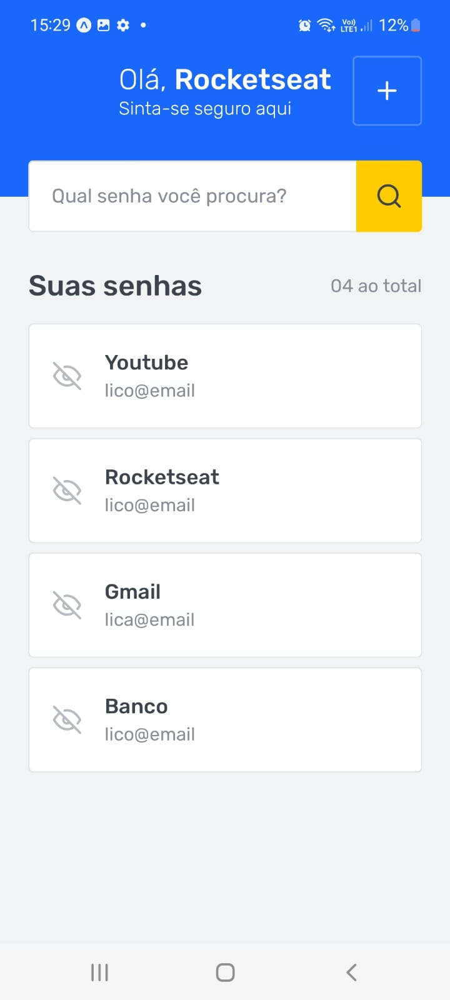
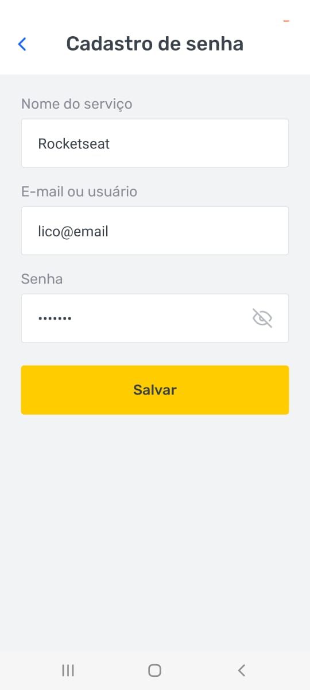
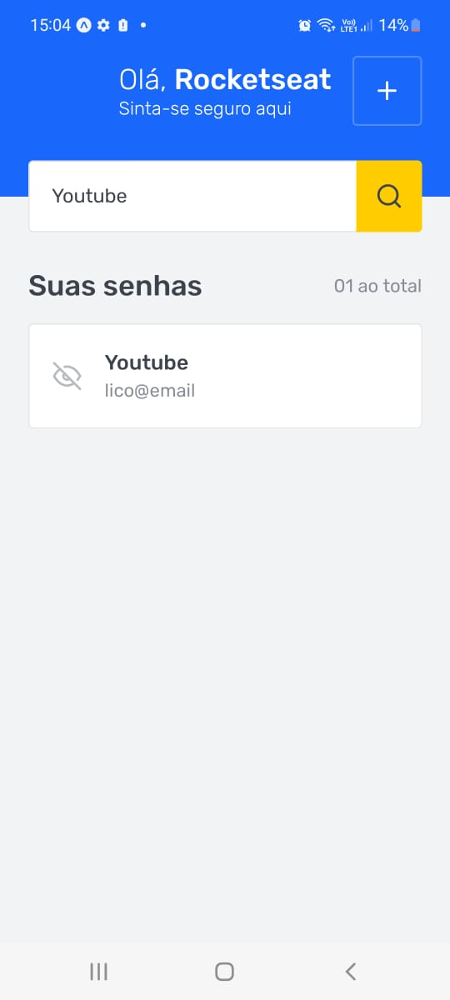

<h1 align="center">SAVEPASS</h1>

## Introdução

O SAVEPASS é um aplicativo para gerenciamento de senhas, onde o usuário pode cadastrar senhas para suas aplicações e pesquisa-las quando precisar.

É um projeto que possuí o intuíto de aplicar os conceitos básicos aprendidos no módulo 2 do curso Ignite React Native da Rocketseat versão 2021.

<div align="center">
  
  
  
</div>

## Tecnologias 

- React Native
- Expo
- Typescript
- Styled Components
- Jest
- Testing-Library
- AsyncStorage
- StackNavigation
- useForm
- Yup


## Requisitos

- Nodejs
- Expo Cli
- Emulador Android Studio ou dispositivo físico
- Expo Go


## Instalação

```sh
# Fazer o clone do projeto em uma máquina local
git clone https://github.com/marciovz/savepass-mobile-ignite2021.git
```

```sh
# Acessa a pasta do projeto
cd savepass-mobile-ignite2021
```

```sh
# Rodar a instalação das dependências do projeto
npm install
```

## Rodando a aplicação

Abrir o emulador ou conectar um dispositivo para rodar a aplicação

```sh
# Rodar o bundle da aplicação.
npx expo start
```
Abrir a aplicação escaneando o QRCode no aplicativo Expo Go

## Melhorias

- Autenticação de usuário
- Criptografia das senhas
- Guardar as senhas em um banco de dados
- Copiar para área de transfência


